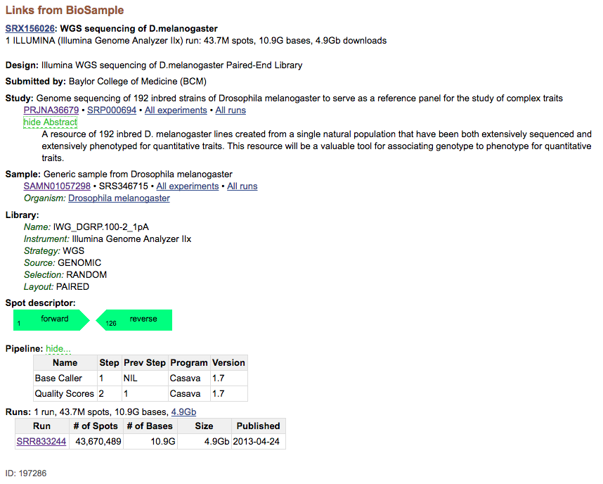
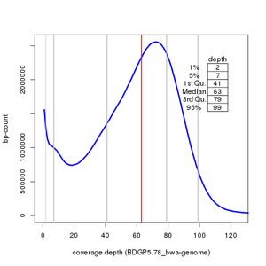
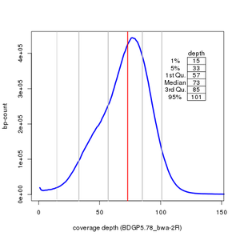
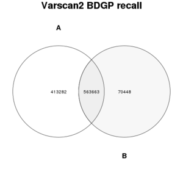
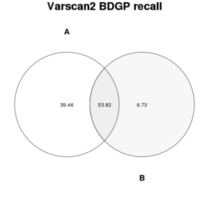
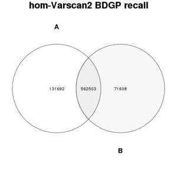
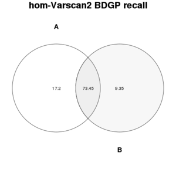

% Analysis of Drosophila melanogaster NGS data  
% @SP, VIB Nucleomics Core & BITS  
% (April 12, 2016 - v1.0)  

## Content
* [Getting public data from SRA](#getting-public-data-from-sra)
* [Preprocess data and prepare accessory files](#preprocess-data-and-prepare-accessory-files)
* [Align reads to the reference genome and compute coverage](#align-reads-to-the-reference-genome-and-compute-coverage)
* [Find differences between sequenced data and reference genome](#find-differences-between-sequenced-data-and-reference-genome)
* [Evaluate the effect of limiting coverage on variant calling](#evaluate-the-effect-of-limiting-coverage-on-variant-calling)
* [Conclusion of this study](#conclusion-of-this-study)

## Getting public data from SRA
*[[back-to-top](#top)]*  

A randomly chosen DGRP genome was selected in SRA and data obtained using aspera. The sample corresponds to the strain **DGRP-100** <http://flybase.org/reports/FBsn0000288.html>. The DGRP resources can be accessed at <http://dgrp2.gnets.ncsu.edu/>
Additional sample information can be found on SRA under the ID *SAMN01057298* and sequenced using a Illumina Genome Analyzer IIx.

The link to the info page for that project is <http://www.ncbi.nlm.nih.gov/biosample/1057298>



### Download SRA data

```bash
url="anonftp@ftp.ncbi.nlm.nih.gov:/sra/sra-instant/reads/ByRun/sra/SRR/"

ascp -i ~/.aspera/connect/etc/asperaweb_id_dsa.openssh \
	-k1 -QTr -l10000m 
	${url}/SRR833/SRR833244/SRR833244.sra \
	/data1/SRR833244/aspera_download
```

## Preprocess data and prepare accessory files
*[[back-to-top](#top)]*  

### Convert SRA to fastQ (paired reads)

```bash
mkdir -p reads
fastq-dump --origfmt -I --split-files --gzip \
	aspera_download/SRR833244.sra \
	-O reads
```

### Control read quality with fastQC

Each file contains 43'670'489 reads (paired).
 
```bash
mkdir -p readQC
fastqc -o readQC --noextract -f fastq reads/SRR833244_1.fastq.gz
fastqc -o readQC --noextract -f fastq reads/SRR833244_2.fastq.gz
```

### Prepare reference files for various tools

A number of scripts and custom functions are repeatedly used in scripts and are shown below.

```bash
function dict2chrsizes {
# create a .chrom.sizes file from PICARD .dict file
# author: Stephane Plaisance
# version: 1.0
echo "# creating ${1%%\.dict}.genome";
grep "^@SQ" ${1} | awk '{split($2,name,":"); 
split($3,len,":"); print name[2]"\t"len[2]}' > ${1%\.dict}.genome
cat ${1%\.dict}.genome
}

function vcf2index() {
# takes a vcf file as argument ($1)
# keeps header and sorts remaining lines
# compresses sorted file with bgzip
# indexes it with tabix for vcftools applications
# author: Stephane Plaisance
# version: 1.0
if [ $# -eq 1 ]
then
title=$(basename "$1" ".vcf")
( grep ^"#" $1 | perl -pi -e "s/$title.*$/$title/";
grep -v ^"#" $1 | sort -k 1V,1 -k 2n,2 ) | bgzip -c > $1".gz"
tabix -p vcf $1".gz"
else
echo "usage: vcf2index <vcf-file>"
fi
}
```

REM: A number of scripts can be found on <https://github.com/BITS-VIB/>.

## Align reads to the reference genome and compute coverage
*[[back-to-top](#top)]*  

### Map reads to the reference genome

The *dm3* reference used for mapping was obtained from Ensembl (Drosophila_melanogaster_BDGP5.dna.toplevel). More recent assembly exists but is much more complex and not easy to combine to public data generated with *dm3*.

```
| Sequence name    | Length (bp) including gaps |
|------------------|----------------------------|
| chr2L            | 23,011,544                 |
| chr2LHet         | 368,872                    |
| chr2R            | 21,146,708                 |
| chr2RHet         | 3,288,761                  |
| chr3L            | 24,543,557                 |
| chr3LHet         | 2,555,491                  |
| chr3R            | 27,905,053                 |
| chr3RHet         | 2,517,507                  |
| chr4             | 1,351,857                  |
| chrX             | 22,422,827                 |
| chrXHet          | 204,112                    |
| chrYHet          | 347,038                    |
| chrU             | 10,049,037                 |
| chrUextra        | 29,004,656                 |
| chrM             | 19,517                     |
| Total: 15        | 168,736,537                |
```

```bash
scripts/mapping_bwa-mem.sh
```

```
87958995 + 0 in total (QC-passed reads + QC-failed reads)
618017 + 0 secondary
0 + 0 supplementary
0 + 0 duplicates
82360678 + 0 mapped (93.64% : N/A)
87340978 + 0 paired in sequencing
43670489 + 0 read1
43670489 + 0 read2
79008486 + 0 properly paired (90.46% : N/A)
80861240 + 0 with itself and mate mapped
881421 + 0 singletons (1.01% : N/A)
1074122 + 0 with mate mapped to a different chr
657884 + 0 with mate mapped to a different chr (mapQ>=5)
```

The mapping efficiency is quite good despite the apparent poor quality of the reads when applying fastQC. This argues against the requirement for filtering and clipping reads when doing genomic mapping, at least when considering this metric alone.

The raw sequencing depth obtained from the sum of all input read pairs times the read length divided by the genome width is (87958995 x 125) / 168'736'537 = **65.16x**

The mapped sequencing depth is close to the first value with (82360678 * 125) / 168'736'537 = **61.01x**

### Compute full genome coverage from mappings

```bash
scripts/bedtools_genomecoverage.sh
# followed by a plotting R script
scripts/plot_coverage.R
# or the live RStudio version
plot_coverage.Rmd
```

Some of the output of the .Rmd code is reproduced here for chr2R and the full genome level.

 

```
# fraction of the chromosome: genome with zero-coverage
 		chr	 depth    count    chrlen     cov%
 12402 genome     0 56803230 168736537 0.336639

# coverage summary for chromosome: genome 
      chr           depth            count             chrlen         
 genome :4048   Min.   :     1   Min.   :      1   Min.   :168736537  
 2L     :   0   1st Qu.:  1013   1st Qu.:      1   1st Qu.:168736537  
 2LHet  :   0   Median :  2024   Median :      7   Median :168736537  
 2R     :   0   Mean   :  7551   Mean   :  27652   Mean   :168736537  
 2RHet  :   0   3rd Qu.:  3677   3rd Qu.:     22   3rd Qu.:168736537  
 3L     :   0   Max.   :538043   Max.   :8430644   Max.   :168736537  
 (Other):   0                                                         
      cov%          
 Min.   :1.000e-08  
 1st Qu.:1.000e-08  
 Median :4.000e-08  
 Mean   :1.639e-04  
 3rd Qu.:1.300e-07  
 Max.   :4.996e-02  
```

 

```
# fraction of the chromosome: 2R with zero-coverage
 	chr	 depth   count   chrlen     cov%
 824  2R     0 2529604 21146708 0.119622

# coverage summary for chromosome: 2R 
      chr          depth             count               chrlen        
 2R     :260   Min.   :   1.00   Min.   :      1.0   Min.   :21146708  
 2L     :  0   1st Qu.:  65.75   1st Qu.:      2.0   1st Qu.:21146708  
 2LHet  :  0   Median : 130.50   Median :      8.0   Median :21146708  
 2RHet  :  0   Mean   : 423.58   Mean   :  71604.2   Mean   :21146708  
 3L     :  0   3rd Qu.: 239.25   3rd Qu.:    133.8   3rd Qu.:21146708  
 3LHet  :  0   Max.   :4601.00   Max.   :1457650.0   Max.   :21146708  
 (Other):  0                                                           
      cov%          
 Min.   :5.000e-08  
 1st Qu.:9.000e-08  
 Median :3.800e-07  
 Mean   :3.386e-03  
 3rd Qu.:6.320e-06  
 Max.   :6.893e-02          
```

### Identify the GAP fraction of the genome

Reference genome always contain N-regions where the sequence was too degenerated to be defined. These GAPs are regions where no mapping can occur and they contribute to an apparent decrease in coverage efficiency.

The **findNregions.pl** Perl script allows identifying GAPs and building a track to identify them using **Bedtools** or visualising them in **IGV**.

```
# find N regions of at least 100bps and create the corresponding BED track
../scripts/fastaFindGaps.pl -i Drosophila_melanogaster.BDGP5.dna.toplevel.fa -l 100 -o Dm_gaps-100.bed
./Dm_gaps-100.bed
## Searching sequence 2L for [N]{100,}
# found 2 matches for 2L
## Searching sequence 2LHet for [N]{100,}
# found 2 matches for 2LHet
## Searching sequence 2R for [N]{100,}
# found 1 matches for 2R
## Searching sequence 2RHet for [N]{100,}
# found 25 matches for 2RHet
## Searching sequence 3L for [N]{100,}
# found 1 matches for 3L
## Searching sequence 3LHet for [N]{100,}
# found 18 matches for 3LHet
## Searching sequence 3R for [N]{100,}
# found 0 matches for 3R
## Searching sequence 3RHet for [N]{100,}
# found 14 matches for 3RHet
## Searching sequence 4 for [N]{100,}
# found 1 matches for 4
## Searching sequence U for [N]{100,}
# found 2804 matches for U
## Searching sequence Uextra for [N]{100,}
# found 34629 matches for Uextra
## Searching sequence X for [N]{100,}
# found 3 matches for X
## Searching sequence XHet for [N]{100,}
# found 0 matches for XHet
## Searching sequence YHet for [N]{100,}
# found 50 matches for YHet
## Searching sequence dmel_mitochondrion_genome for [N]{100,}
# found 0 matches for dmel_mitochondrion_genome

############################ summary #####################################
# 15 fasta entries (168,736,537 bps)
# reported a total of 37550 N-regions of 100 bps or more
# for a total N-length of 6,364,966 bps (3.8% of represented sequences)
```

6Mb of the reference are occupied by N's, likely representing the telomeres and centromeres for the largest part. There regions can obviously not be mapped by reads and are good to know when visualising the data.

## Find differences between sequenced data and reference genome
*[[back-to-top](#top)]*  

### extract the individual from the published multi-genome variant file

This genome is part of a set of 205 individuals and a global VCF file is available at DGRP <http://dgrp2.gnets.ncsu.edu/data/website/dgrp2.vcf> from which we could extract the calls reported for DGRP-100 with a combination of **SnpSift** and **vcftools (vcfsubset)** commands.

```bash
cat dgrp2.vcf | java -jar /opt/biotools/snpeff/SnpSift.jar filter \
	"isVariant( GEN[line_100] )" | vcf-subset -c "line_100" | \
	bgzip -c > DGRP2_100_variants.vcf.gz && \
	tabix -p vcf DGRP2_100_variants.vcf.gz
```

```
# summary of results
Only variants will be reported
Min coverage:   8
Min reads2:     2
Min var freq:   0.2
Min avg qual:   15
P-value thresh: 0.01
Reading input from STDIN
157247209 bases in pileup file
989005 variant positions (855562 SNP, 133443 indel)
12060 were failed by the strand-filter
976945 variant positions reported (844512 SNP, 132433 indel)
```

### Call variants with Varscan2 mpileup2cns

Local variant calling from the mapped data was performed using **Varscan2** in order to evaluate its performance as compared to the DGRP gold standard. All caller options were kept to default in order to keep it simple but could be tuned to better fit user prior knowledge and expectations.

```bash
# see script code for details
scripts/varscan2-mpileup2cns_call-variants.sh
```

### Compare results with DGRP2 calls for the same genome

Resulting calls were intersect with the reported DGRP2_100 variants.

```bash
all_calls=BDGP5.78_bwa_varscan2_variants/BDGP5.78_mpileup2cns.vcf.gz
gold=reference/DGRP2_100_variants.vcf.gz

scripts/vcf-compare-2.sh ${all_calls} ${gold} VCF-compare2gold
```

```
## venn comparison results for:
# 1:    BDGP5.78_bwa_varscan2_variants/BDGP5.78_mpileup2cns.vcf.gz
# 2:    reference/DGRP2_100_variants.vcf.gz
70448   2  (11.1%)
413282  1  (42.3%)
563663  1  (57.7%)  2  (88.9%)

# plot Venn diagrams
2DVenn.R -a 413282 -b 70448 -i 563663 -t "Varscan2 BDGP recall" \
	-x 1 -o BDGP-recall -u 2 
2DVenn.R -a 413282 -b 70448 -i 563663 -t "Varscan2 BDGP recall" \
	-x 1 -o BDGP-recallpc -u 2 -P 1
```

 

 

Because the golden set consists only of homozygous calls, we can likewise filter our Varscan calls to see if we improve the recall scores.

```bash
# extract homozygous calls only since the fly was imbred 
# and only ho-calls are present in the gold standard.
gzip -cd BDGP5.78_mpileup2cns.vcf.gz | \
	java -jar /opt/biotools/snpeff/SnpSift.jar filter \
	"ishom( GEN[0] ) & isVariant( GEN[0] )" | \
	bgzip -c > hom_BDGP5.78_mpileup2cns.vcf.gz && \
	tabix -p vcf hom_BDGP5.78_mpileup2cns.vcf.gz


hom_calls=BDGP5.78_bwa_varscan2_variants/hom_BDGP5.78_mpileup2cns.vcf.gz
gold=reference/DGRP2_100_variants.vcf.gz

scripts/vcf-compare-2.sh ${hom_calls} ${gold} VCF-compare_hom2gold
```

```
## venn comparison results for:
# 1:    BDGP5.78_bwa_varscan2_variants/hom_BDGP5.78_mpileup2cns.vcf.gz
# 2:    reference/DGRP2_100_variants.vcf.gz
71608   2  (11.3%)
131692  1  (19.0%)
562503  1  (81.0%)  2  (88.7%)

# plot Venn diagrams
2DVenn.R -a 131692 -b 71608 -i 562503 -t "hom-Varscan2 BDGP recall" \
	-x 1 -o pictures/hom_BDGP-recall -u 2 
2DVenn.R -a 131692 -b 71608 -i 562503 -t "hom-Varscan2 BDGP recall" \
	-x 1 -o pictures/hom_BDGP-recallpc -u 2 -P 1
```

 

 

The results suggests that a number of het-calls produced by Varscan2 may be false positives (a fraction of the missing 19% of input). We also miss 71608 calls from the golden standard (11% of input) when applying Varscan2 with default parameters.

## Evaluate the effect of limiting coverage on variant calling 
*[[back-to-top](#top)]*  

The most important question assessed by this study is to define the minimal coverage depth (quantity of NGS reads) that will be required to correctly call as many as possible true variants in a fly genome. In order to find this limit, we can downsample the data published in the BDGP study and monitor the recall with our own calls aas compared to the published results.
 
### Subsample the BAM file and repeat the exercise

A number of random subset were taken that keep 25%, 33%, and 50% of the full data, respectively. We took subsets of the BAM data directly which was shown in a separate experiment to be equivalent to mapping subsets of the original read pairs and using the BAM data for calling.

```bash
## 50% subset
java -jar $PICARD/picard.jar DownsampleSam \
	I=SRR833244_dm5-pe.bam O=SRR833244_dm5-pe_50pc.bam R=1 P=0.50 &&
	samtools flagstat SRR833244_dm5-pe_50pc.bam
```

```
43980693 + 0 in total (QC-passed reads + QC-failed reads)
308669 + 0 secondary
0 + 0 supplementary
0 + 0 duplicates
41179440 + 0 mapped (93.63% : N/A)
43672024 + 0 paired in sequencing
21836012 + 0 read1
21836012 + 0 read2
39504532 + 0 properly paired (90.46% : N/A)
40430100 + 0 with itself and mate mapped
440671 + 0 singletons (1.01% : N/A)
536938 + 0 with mate mapped to a different chr
329206 + 0 with mate mapped to a different chr (mapQ>=5)
```

```bash
## 33% subset
java -jar $PICARD/picard.jar DownsampleSam \
	I=SRR833244_dm5-pe.bam O=SRR833244_dm5-pe_33pc.bam R=1 P=0.33 &&
	samtools flagstat SRR833244_dm5-pe_33pc.bam
```

```
29025253 + 0 in total (QC-passed reads + QC-failed reads)
203421 + 0 secondary
0 + 0 supplementary
0 + 0 duplicates
27178390 + 0 mapped (93.64% : N/A)
28821832 + 0 paired in sequencing
14410916 + 0 read1
14410916 + 0 read2
26073898 + 0 properly paired (90.47% : N/A)
26684002 + 0 with itself and mate mapped
290967 + 0 singletons (1.01% : N/A)
354196 + 0 with mate mapped to a different chr
217040 + 0 with mate mapped to a different chr (mapQ>=5)
```

```bash
## 25% subset
java -jar $PICARD/picard.jar DownsampleSam \
	I=SRR833244_dm5-pe.bam O=SRR833244_dm5-pe_25pc.bam R=1 P=0.25 &&
	samtools flagstat SRR833244_dm5-pe_25pc.bam
```

```
21996974 + 0 in total (QC-passed reads + QC-failed reads)
153974 + 0 secondary
0 + 0 supplementary
0 + 0 duplicates
20597195 + 0 mapped (93.64% : N/A)
21843000 + 0 paired in sequencing
10921500 + 0 read1
10921500 + 0 read2
19761128 + 0 properly paired (90.47% : N/A)
20222866 + 0 with itself and mate mapped
220355 + 0 singletons (1.01% : N/A)
268046 + 0 with mate mapped to a different chr
164409 + 0 with mate mapped to a different chr (mapQ>=5)
```

As expected, all metrics are comparable between subsets with 93% mapped reads and 90% proper pairs.

### Call variants for each BAM subset

To do so, we can loop through the three subsets with one bash command.

```bash
ref=$REFERENCE/dm5/Drosophila_melanogaster.BDGP5.dna.toplevel.fa.gz
for b in BDGP5.78_bwa-mapping/SRR833244_dm5-pe_*.bam; 
	do echo "#processing $b"; 
	o=$(basename $b .bam); 
	samtools mpileup -f ${ref} $b | \
	java -Xmx24G -jar $VARSCAN/VarScan.v2.4.1.jar mpileup2cns \
	--variants --output-vcf 1 --p-value 0.01 \
	> BDGP5.78_bwa_varscan2_variants/${o}_mpileup2cns.vcf &&\
	vcf2index BDGP5.78_bwa_varscan2_variants/${o}_mpileup2cns.vcf;
done
```

```
## to be compared with the full data results
# full set
157247209 bases in pileup file
989005 variant positions (855562 SNP, 133443 indel)
12060 were failed by the strand-filter
976945 variant positions reported (844512 SNP, 132433 indel)

# 50pc set
155732677 bases in pileup file
929801 variant positions (807046 SNP, 122755 indel)
6162 were failed by the strand-filter
923639 variant positions reported (801339 SNP, 122300 indel)

# 33pc set
154447929 bases in pileup file
856107 variant positions (746224 SNP, 109883 indel)
3451 were failed by the strand-filter
852656 variant positions reported (743016 SNP, 109640 indel)

# 25pc set
153329978 bases in pileup file
769062 variant positions (673132 SNP, 95930 indel)
2177 were failed by the strand-filter
766885 variant positions reported (671102 SNP, 95783 indel)
```

In summary:

```
|  subset    | #variants |  %tot  |  #SNV  | #Indels |
|------------|-----------|--------|--------|---------|
| full data  |  976945   |  100%  | 844512 |  132433 |
| 50% sample |  923639   |   94%  | 801339 |  122300 |
| 33% sample |  852656   |   87%  | 743016 |  109640 |
| 25% sample |  766885   |   78%  | 671102 |   95783 |
```

Again, the results are quite comparable between sets with a 22% decrease in the number of calls where the sequencing depth was decreased to 25% (~12x coverage).

### Compute descriptive statistics based on variant depth from each result

```bash
for v in *.vcf; do echo ${v};
	## compute mean sequencing depth from the VCF data
	vcftools --vcf ${v} --depth -c > sequencing-depth_summary_${v%%.vcf}.txt
	cat sequencing-depth_summary_${v%%.vcf}.txt
	
	## compute site depth descriptive stats from the VCF data
	vcftools --vcf ${v} --site-depth -c > site-depth_summary_${v%%.vcf}.txt
	sed -e '1d' site-depth_summary_${v%%.vcf}.txt | cut -f 3 | qstats
done
```

```
## 25% subset
SRR833244_dm5-pe_25pc_mpileup2cns.vcf
INDV    N_SITES MEAN_DEPTH
Sample1 766885  16.0129

Min.     8
1st Qu.  12
Median   15
Mean     16.0129
3rd Qu.  19
Max.     1898
Range    1890
Std Dev. 9.06703
Length   766885

## 33% subset
SRR833244_dm5-pe_33pc_mpileup2cns.vcf
INDV    N_SITES MEAN_DEPTH
Sample1 852656  20.1691

Min.     8
1st Qu.  15
Median   20
Mean     20.1691
3rd Qu.  24
Max.     2507
Range    2499
Std Dev. 11.5248
Length   852656

## 50% subset
SRR833244_dm5-pe_50pc_mpileup2cns.vcf
INDV    N_SITES MEAN_DEPTH
Sample1 923639  29.3742

Min.     8
1st Qu.  22
Median   29
Mean     29.3742
3rd Qu.  36
Max.     3784
Range    3776
Std Dev. 16.9202
Length   923639

## full data
BDGP5.78_mpileup2cns.vcf
INDV    N_SITES MEAN_DEPTH
Sample1 976945  56.6087

Min.     8
1st Qu.  43
Median   58
Mean     56.6087
3rd Qu.  70
Max.     7744
Range    7736
Std Dev. 32.1147
Length   976945
```

The variant sequencing depth mean follows the subsampling value while the variant count is less affected, suggesting that even the lowest 25% coverage is not yet 'too' detrimental for this metric. The minimal value of 8 for site-depth comes directly from the parameter set for Varscan2.

### Prepare variant lists for VCF comparison 

Comparing variant recall between our Varscan data and the gold-standard for this single genome will tell us if coverage depth becomes a limit.

We downloaded the published variant list for the strain **DGRP-100** and consider them as gold-standard. This lists only include homozygous variants since the analysed strains are inbred. We therefore filter our calls and keep only hom-calls for comparison.

```bash
# extract hom-calls from each set
for pc in 25 33 50; 
do gzip -cd SRR833244_dm5-pe_${pc}pc_mpileup2cns.vcf.gz | \
	java -jar /opt/biotools/snpeff/SnpSift.jar filter \
	"ishom( GEN[0] ) & isVariant( GEN[0] )" | \
	bgzip -c > hom_${pc}pc-BDGP5.78_mpileup2cns.vcf.gz &&\
	tabix -p vcf hom_${pc}pc-BDGP5.78_mpileup2cns.vcf.gz;
done
```

### Compare hom-calls with the BDGP 'gold' variant list

```bash
for pc in 25 33 50;
	do echo "# processing hom_${pc}pc-BDGP5.78_mpileup2cns.vcf.gz"
	hom_calls=BDGP5.78_bwa_varscan2_variants/hom_${pc}pc-BDGP5.78_mpileup2cns.vcf.gz
	gold=reference/DGRP2_100_variants.vcf.gz

	# compare using a small bash script
	result=VCF-compare_hom2gold_${pc}pc
	mkdir -p ${result}
	scripts/vcf-compare-2.sh ${hom_calls} ${gold} ${result}
done
```

```
## 25% subset
## venn comparison results for:
# 1:    BDGP5.78_bwa_varscan2_variants/hom_25pc-BDGP5.78_mpileup2cns.vcf.gz
# 2:    reference/DGRP2_100_variants.vcf.gz
108954  1  (17.9%)
135558  2  (21.4%)
498553  1  (82.1%)  2  (78.6%)

# plot Venn diagrams
2DVenn.R -a 108954 -b 135558 -i 498553 -t "hom-Varscan2_25pc BDGP recall" \
	-x 1 -o pictures/hom_BDGP_25pc-recall -u 2 
2DVenn.R -a 108954 -b 135558 -i 498553 -t "hom-Varscan2_25pc BDGP recall" \
	-x 1 -o pictures/hom_BDGP_25pc-recallpc -u 2 -P 1
	
## 33% subset
## venn comparison results for:
# 1:    BDGP5.78_bwa_varscan2_variants/hom_33pc-BDGP5.78_mpileup2cns.vcf.gz
# 2:    reference/DGRP2_100_variants.vcf.gz
101059  2  (15.9%)
117674  1  (18.1%)
533052  1  (81.9%)  2  (84.1%)

# plot Venn diagrams
2DVenn.R -a 117674 -b 101059 -i 533052 -t "hom-Varscan2_33pc BDGP recall" \
	-x 1 -o pictures/hom_BDGP_33pc-recall -u 2 
2DVenn.R -a 117674 -b 101059 -i 533052 -t "hom-Varscan2_33pc BDGP recall" \
	-x 1 -o pictures/hom_BDGP_33pc-recallpc -u 2 -P 1
	
## 50% subset
## venn comparison results for:
# 1:    BDGP5.78_bwa_varscan2_variants/hom_50pc-BDGP5.78_mpileup2cns.vcf.gz
# 2:    reference/DGRP2_100_variants.vcf.gz
80192   2  (12.6%)
124216  1  (18.3%)
553919  1  (81.7%)  2  (87.4%)

# plot Venn diagrams
2DVenn.R -a 124216 -b 80192 -i 553919 -t "hom-Varscan2_50pc BDGP recall" \
	-x 1 -o pictures/hom_BDGP_50pc-recall -u 2 
2DVenn.R -a 124216 -b 80192 -i 553919 -t "hom-Varscan2_50pc BDGP recall" \
	-x 1 -o pictures/hom_BDGP_50pc-recallpc -u 2 -P 1


### for reference: the full data
## venn comparison results for:
# 1:    BDGP5.78_bwa_varscan2_variants/hom_BDGP5.78_mpileup2cns.vcf.gz
# 2:    reference/DGRP2_100_variants.vcf.gz
71608   2  (11.3%)
131692  1  (19.0%)
562503  1  (81.0%)  2  (88.7%)

# plot Venn diagrams
2DVenn.R -a 131692 -b 71608 -i 562503 -t "hom-Varscan2 BDGP recall" \
	-x 1 -o pictures/hom_BDGP-recall -u 2 
2DVenn.R -a 131692 -b 71608 -i 562503 -t "hom-Varscan2 BDGP recall" \
	-x 1 -o pictures/hom_BDGP-recallpc -u 2 -P 1
```

In summary:

```
| subset    | #Varscan-only | shared-calls | %Varscan | %BDGP-100 | #BDGP-only |
|-----------|---------------|--------------|----------|-----------|------------|
| 100% ~65x |     131692    |    562503    |  81.0%   |    88.7%  |    71608   |
|  50% ~32x |     124216    |    553919    |  81.7%   |    87.4%  |    80192   |
|  33% ~21x |     117674    |    533052    |  81.9%   |    84.1%  |   101059   |
|  25% ~16x |     108954    |    498553    |  82.1%   |    78.6%  |   135558   |
```

## Conclusion of this study
*[[back-to-top](#top)]*  

Increasing the depth of sequencing slightly improves the **recall sensitivity** of known variants from 78.6% (25% data ~ 16x raw coverage) to 84.1% (33% data ~ 21x raw coverage), 87.4% (50% data ~ 32x raw coverage) as compared to the recall of 88.7% for full data analysis (~65x raw coverage) . 

If missing 10% of the variants is not an issue, a sequencing depth of ~12x seems sufficient to achieve the goal of Drosophila variant sequencing but a raw coverage of 30x to 50x will be a better choice to stay closer to the reference results obtained by others and keep some safety margin.

 more at **<http://www.bits.vib.be>**
